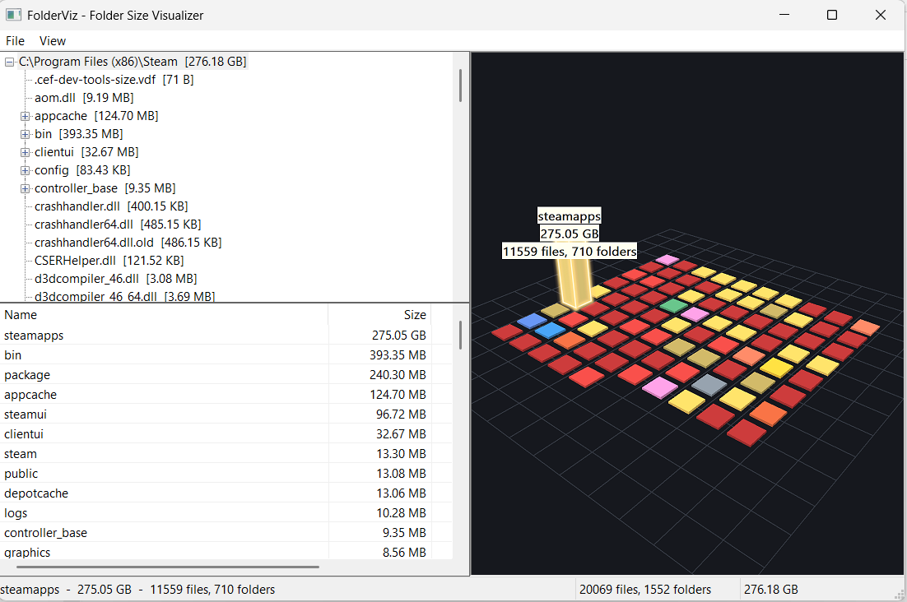

# FolderViz

A small WinDirStat-style folder size visualizer for Windows, written in C++20 with the
Win32 API and GDI. No third-party dependencies.



## Features

- **Parallel recursive scan** on a background thread using `FindFirstFileEx` with large
  fetch, keeping the UI responsive. Cancellable.
- **Directory tree** (left) with aggregate sizes, lazily populated for large trees.
- **Virtual file list** (right) with sortable Name / Size / % / Type columns.
- **Squarified treemap** (bottom) of the selected directory, colored by file extension,
  with a legend and hover/selection highlighting.
- **3D city view** (default; toggled from the View menu): each immediate child of the
  selected directory becomes a building on a grid — folders and files alike, folder height
  proportional to size. Click a building to select it; it glows and shows a label with its
  name, size, and contained file/folder counts. Orbit/zoom and double-click to drill in.
  Rendered in software with GDI at 2× and downsampled for antialiasing, no extra
  dependencies. The visualization occupies the right pane, with the tree above the file
  list on the left.
- **Drill-down**: double-click a directory rectangle/building or file-list row to navigate.
- Skips junctions/symlinks/reparse points to avoid cycles and double counting; reports
  unreadable directories instead of failing.
- Per-monitor DPI aware, visual styles (Common Controls v6).

## Build

Requirements: Visual Studio 2022 Build Tools with the C++ workload (MSVC + Windows SDK)
and Ninja. The bundled CMake from the VS installation is used automatically.

```powershell
.\build.ps1            # Release
.\build.ps1 -Config Debug
```

This configures `build/` with CMake + Ninja and produces `build\FolderViz.exe`.
To use a system CMake instead, run:

```powershell
cmake -S . -B build -G Ninja -DCMAKE_BUILD_TYPE=Release
cmake --build build
```

## Usage

Launch with `FolderViz.exe` and choose **File > Scan Folder...** (Ctrl+O), or start straight
from the command line:

- `FolderViz.exe "C:\path\to\folder"` — scan immediately (opens in the 3D city view).
- `FolderViz.exe --treemap "C:\path\to\folder"` — start in the treemap instead.
- `--city` forces the city view (it is the default).

A quick tour:

1. **Scan** a folder. The directory tree fills in on the top-left, the file list below it,
   and the visualization on the right.
2. **Inspect an item** by clicking its building. It glows and shows a label with its name,
   size, and how many files/folders it contains (the same info appears in the status bar).
   A single click only selects; it does not leave the current folder.
3. **Travel into a folder** by double-clicking its building. The tree selection, file list,
   and city all switch to show that folder's contents. Folder rows in the file list work the
   same way.
4. **Go back up** — click any parent folder in the **top-left tree**. Selecting a folder
   there opens it, so the tree doubles as the navigation history/back button.
5. **Orbit the city**: drag to rotate, mouse wheel to zoom, right-click to reset the camera.
6. **Switch views** with **View > Treemap** for a flat squarified map colored by file
   extension, with a legend.

Controls:

| Action | Effect |
| --- | --- |
| Click tree node | Open that directory in the list and visualization |
| View menu | Switch between **Treemap** and **3D City** |
| Click a treemap rect | Highlight the item (status bar shows name/size) |
| Double-click a treemap rect / list row | Drill into a directory |
| Click a list column header | Sort by that column |
| F5 | Rescan the current root |
| Ctrl+O | Choose another folder |

3D city view:

| Action | Effect |
| --- | --- |
| Drag | Orbit the camera |
| Mouse wheel | Zoom in/out |
| Right-click | Reset the camera |
| Click a building | Select/inspect it; it glows and shows name, size, file/folder counts |
| Double-click a folder building | Travel into that folder (same as the list/tree) |

## Project layout

```
src/
  main.cpp        WinMain, common controls + COM init, command line
  app.cpp/.h      Win32 UI: tree, virtual list, treemap window, menus, layout
  scanner.cpp/.h  Parallel recursive scanner + progress/cancel
  fsnode.h        Node tree (files/directories) and aggregation
  treemap.cpp/.h  Squarified treemap layout
  city.cpp/.h     Software 3D "city" renderer (orbiting camera, GDI polygons)
  filetype.cpp/.h Extension -> color mapping
  format.h        Human-readable size formatting
app.manifest      Common Controls v6 + PerMonitorV2 DPI awareness
```

## How it works

The scanner pushes the root directory onto a work queue processed by a pool of worker
threads. Each worker enumerates one directory, appends file/directory nodes to that
directory's own `children` vector (safe because a directory is owned by exactly one
worker), and enqueues subdirectories, incrementing an outstanding-task counter. When the
counter reaches zero, the coordinating thread computes bottom-up aggregate sizes and
counts, then notifies the UI. Progress is reported by posting messages throttled to
~60 ms so the UI thread only reads atomic counters.

The treemap uses the squarified algorithm (Bruls, Huizing, van Wijk) to keep rectangle
aspect ratios close to 1, sorting children by descending size.

The 3D city view is a small software renderer: it builds a box per immediate child,
places them on a centered grid, and each frame transforms the 8 corners of every visible
face through an orbiting perspective camera, culls back faces, shades them with a single
Lambert light, depth-sorts by building and fills the resulting quads with GDI `Polygon`.
The frame is drawn at 2× resolution and downsampled (`StretchBlt` with `HALFTONE`) for
antialiasing, and GDI brushes/pens are cached per color so large directories stay fast.
Selecting a building brightens its faces, draws a soft alpha-blended glow around its
visible faces (GDI+, the one place GDI's opaque pens are not enough), and draws an info
label last so the glow never washes it out. Because there is no Z-buffer, painter's
ordering (drawn back-to-front) is what resolves occlusion, which is sufficient for
non-overlapping grid-placed boxes.

## Limitations / notes

- Hard links are currently counted once per directory entry rather than deduplicated by
  file identity (Windows hard links are uncommon outside `WinSxS`). Reparse points are
  skipped entirely.
- The treemap shows one directory level at a time (drill down by double-clicking) rather
  than the full recursive map WinDirStat uses.
- The 3D city view likewise shows the immediate children of the selected directory
  (folders and files); building height is linear in size, so a single much-larger item can
  dominate the skyline. There is no Z-buffer (painter's algorithm only).
- No "free space" pseudo-file block is drawn.

## Verification

The scanner/aggregation was cross-checked against PowerShell's `Get-ChildItem -Recurse`
(numbers measured during development):

| Folder | Result |
| --- | --- |
| `src` | 52,487 bytes / 11 files / 0 dirs — exact match |
| project root | 2,353,997 bytes / 42 files / 11 dirs — exact match |
| `C:\Windows\System32` | 11,800,766,460 bytes / 24,256 files / 1,657 dirs — exact match (scan ~103 ms vs ~1022 ms) |

A crafted junction test confirmed reparse points are skipped (1 file / 1 dir / 1 skipped,
size not double counted).

## Credits and acknowledgements

- The squarified treemap layout follows the algorithm by Mark Bruls, Kees Huizing, and
  Jarke J. van Wijk, *"Squarified Treemaps"* (2000).
- Inspired by **WinDirStat** and its predecessors **KDirStat** and **SequoiaView**. This is
  an independent implementation: it contains no WinDirStat code or assets and is not
  affiliated with or endorsed by the WinDirStat authors.
- The alpha-blended selection glow uses **GDI+**, a Windows system component.

## License

Released under the [MIT License](LICENSE).

